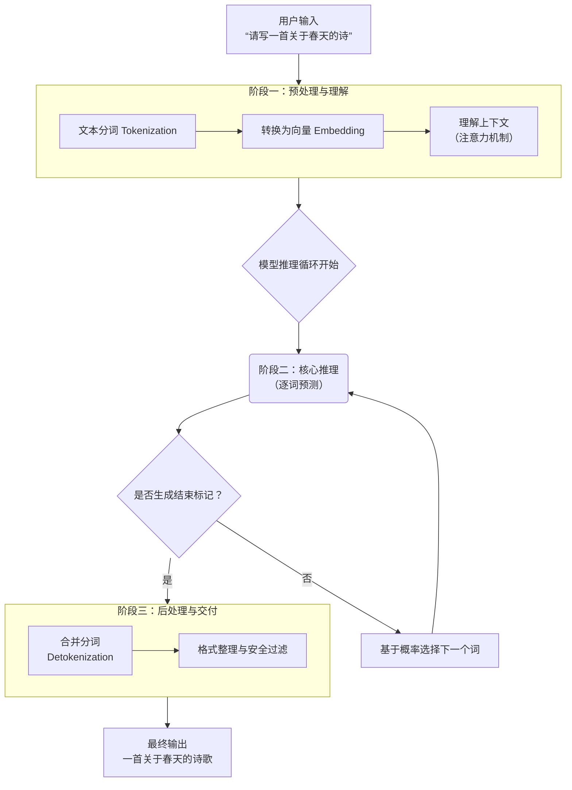
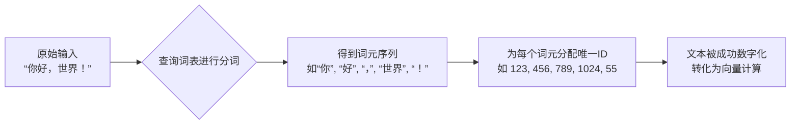
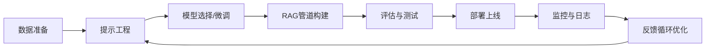

@[TOC](大模型技术全景与核心概念解析：从基础原理到AI智能体架构)
# 大模型技术全景与核心概念解析：从基础原理到AI智能体架构


## 📖 概念索引与要点概览

| 概念                         | 核心定义                                                     | 主要作用与意义                                               |
| :--------------------------- | :----------------------------------------------------------- | :----------------------------------------------------------- |
| **LLM（大语言模型）**        | 基于海量文本训练、能理解与生成自然语言的深度学习模型。       | 现代AI语言能力的核心，支撑各类文本生成与理解任务。           |
| **LLMOps**                   | **大语言模型运维**，涵盖LLM应用开发、部署、监控与维护的全流程工程实践。 | 确保LLM应用稳定、高效、可靠运行，连接模型研发与实际业务落地。 |
| **AIGC（人工智能生成内容）** | 利用AI自动生成文本、图像、音频、视频等内容的技术。           | 推动内容创作自动化，赋能创意产业与数字内容生产。             |
| **AGI（通用人工智能）**      | 具备与人类相当或超越人类的全面认知能力的AI系统。             | AI研究的长期目标，追求人类级别的通用智能。                   |
| **AI智能体（Agent）**        | 能够感知环境、进行决策并执行动作，以自主完成特定目标的AI系统。 | 将大模型能力转化为自主思考和行动的实体，是AI技术的应用落地方向。 |
| **Prompt（提示词）**         | 用户输入给模型的指令或问题，用于引导模型生成特定输出。       | 决定模型输出质量与方向的关键输入，是"引导"模型思考的指令。   |
| **Token（标记）**            | **文本处理的基本单位**，由分词器（Tokenizer）将文本拆分而成。 | 模型理解与生成的"语言"单位；API计算与计费的基础。            |
| **B（FLOPs单位）**           | **十亿次浮点运算**，是衡量模型**计算复杂度或计算量**的常用单位。 | 量化模型推理或训练的"工作量"，是评估算力需求与成本的核心指标。 |
| **LoRA（低秩适应）**         | 一种高效微调大模型的技术，通过插入低秩矩阵更新部分参数。     | 大幅降低大模型微调成本，使个性化适配更可行。                 |
| **矢量/向量数据库**          | 专门用于存储和检索高维向量（如Embedding向量）的数据库。      | 支撑语义搜索、RAG等应用，实现基于内容相似性的高效检索。      |
| **数据蒸馏**                 | 从大规模数据或模型中提取核心知识，用于训练更小、更高效的模型。 | 模型压缩与知识迁移的关键技术，平衡性能与效率。               |
| **Embedding（嵌入）**        | 将文本映射为高维向量的过程，捕捉语义信息。                   | 文本的数学表示，使语义计算成为可能。                         |
| **MoE（混合专家模型）**      | 一种**稀疏神经网络架构**，由多个"专家"子网络和一个"门控网络"组成。 | 以**接近小模型的成本**，获得**媲美超大模型的能力**，突破模型规模的瓶颈。 |
| **MCP（模型上下文协议）**    | 一个**标准化的通信协议**，用于大模型安全、便捷地调用外部工具和数据源。 | 构建**AI智能体**的"连接器"与"安全员"，解决工具调用碎片化问题。 |
| **Copilot（辅助编程）**      | 基于大模型的代码生成与补全工具，如GitHub Copilot。           | 提升开发者效率的AI编程助手，是AI在垂直领域的典型应用。       |

---

## 一、大模型基础概念全景

### 1.1 LLM（大语言模型）

大语言模型是基于Transformer架构、在海量文本数据上预训练的深度学习模型。它通过自监督学习掌握语言规律，能够理解、生成和推理自然语言，是当前AI技术的核心基础。

### 1.2 LLMOps（大语言模型运维）

LLMOps是MLOps在大型语言模型领域的扩展，专注于LLM应用的全生命周期管理。与传统的MLOps相比，LLMOps需要处理提示工程、RAG流水线、模型微调、成本优化等独特挑战。

**核心组成部分**：

1. **开发流水线**：提示版本控制、评估、RAG流水线构建
2. **部署与监控**：模型部署、API管理、性能与成本监控
3. **评估与迭代**：A/B测试、持续评估、反馈循环
4. **安全与合规**：内容过滤、数据隐私、合规性检查

### 1.3 AIGC（人工智能生成内容）

AIGC指利用AI技术自动生成各类内容，包括文本、图像、音频、视频、代码等。大语言模型是AIGC在文本领域的主要实现方式，正推动内容创作进入自动化时代。

### 1.4 AGI（通用人工智能）

AGI是具备人类水平认知能力的AI系统，能跨领域学习、推理和解决问题。当前的大模型虽在某些任务上表现出色，但距真正的AGI仍有距离，AI智能体是其重要演进方向。

### 1.5 AI智能体（Agent）概述

AI智能体是具备自主感知、决策和执行能力的AI系统。它不仅是对话工具，更是能主动思考、规划和行动的智能实体，代表了大模型能力的终极应用形态。

### 1.6 Prompt（提示词）工程

提示词是与大模型交互的核心界面。好的提示词能显著提升模型输出质量，涉及指令设计、上下文提供、示例选择等技巧，是发挥模型潜力的关键。

---

## 二、大模型工作原理详解

### 2.1 核心工作流程图



### 2.2 四大关键阶段详解

#### 阶段零：训练（模型的"学习"过程）

1. **预训练**：在海量互联网文本上，以"完形填空"的方式进行自监督学习
2. **对齐训练（微调）**：使用人类标注数据，通过RLHF等技术让模型变得"有用、诚实、无害"

#### 阶段一：预处理与理解

1. **分词**：将输入文本拆分成词元（Token）
2. **向量化**：将词元转换为高维向量（Embedding）
3. **编码与上下文理解**：通过Transformer的自注意力机制理解语义关系

#### 阶段二：核心推理（逐词生成循环）

1. **自回归生成**：基于已生成文本预测下一个词
2. **概率采样**：根据温度参数从概率分布中选择下一个词
3. **循环终止**：遇到结束标记或达到最大长度时停止

#### 阶段三：后处理与交付

1. **词元合并**：将词元序列转换回自然文字
2. **格式整理与安全过滤**：确保输出格式美观、内容安全

### 2.3 Transformer架构与注意力机制

Transformer是现代LLM的基石，其核心是**自注意力机制**，允许模型在处理一个词时"关注"输入中所有相关的词，从而真正理解上下文和长距离依赖关系。

---

## 三、核心概念深度解析

### 3.1 Token与词表

#### Token：大模型的"语言"单位

Token是文本处理的基本单位，其分词原理采用**子词(Subword)**算法：

- **BPE (Byte Pair Encoding)**：通过合并高频相邻符号构建词汇表（GPT系列采用）
- **WordPiece**：基于概率合并的策略（BERT采用）
- **Unigram Language Model**：从大词汇表逐步裁剪得到目标词表

#### 词表：大模型的"内部词典"

词表包含模型能认识的所有基本文本单位（词元），每个词元有唯一ID。它是连接自然语言与数学计算的桥梁。



### 3.2 B（FLOPs）：计算工作量单位

B是衡量模型算力需求的关键单位，指**十亿次浮点运算**。

**核心公式**：处理1个Token ≈ `6 * N` FLOPs（N为参数量，以十亿为单位）

**示例**：70亿参数模型处理1个Token ≈ 42B FLOPs（420亿次运算）

### 3.3 Embedding：文本的数学表示

Embedding是将文本映射为高维向量的过程，每个向量在"语义空间"中有特定坐标，封装了词的语义和语法信息。这是模型处理文本的数学基础。

### 3.4 LoRA：高效微调技术

LoRA通过插入低秩矩阵更新部分参数，而非全量微调，能：

- 减少90%以上可训练参数
- 大幅降低显存需求
- 保持模型性能基本不变
- 支持多个任务适配器快速切换

---

## 四、高级架构与协议

### 4.1 MoE：混合专家模型

MoE通过**稀疏激活**突破模型规模瓶颈：

**核心机制**：

- 大量独立的前馈神经网络（专家）
- 门控网络动态选择Top-K专家计算
- 其余专家保持"休眠"

**核心优势**：总参数量可达万亿级别，但激活参数量仅相当于小模型，实现"大容量、低成本"。

**代表模型**：Switch Transformer、GLaM、Mixtral-8x7B

### 4.2 MCP：模型上下文协议

MCP是大模型连接外部世界的标准化接口：

**解决的问题**：工具调用接口混乱、安全权限管理困难

**工作方式**：定义工具描述、调用和结果返回的标准格式，MCP服务器提供工具并执行操作。

**配置示例**：

```json
{
  "mcpServers": {
    "file_system": {
      "command": "npx",
      "args": ["-y", "@modelcontextprotocol/server-filesystem", "/允许访问的目录路径"]
    }
  }
}
```

### 4.3 LLMOps：大语言模型运维

LLMOps是确保LLM应用从开发到生产全链路稳定运行的关键实践体系。

#### LLMOps工作流



#### 关键组件与挑战

1. **提示版本控制**：跟踪和管理提示词变更，确保可复现性
2. **评估框架**：自动化评估生成质量、相关性、安全性
3. **成本优化**：监控Token使用量，优化提示和缓存策略
4. **性能监控**：跟踪延迟、吞吐量、错误率等SLA指标
5. **安全合规**：内容过滤、数据泄露防护、合规性检查

#### 典型LLMOps工具栈

- **实验跟踪**：Weights & Biases、MLflow
- **评估平台**：LangSmith、Ragas、DeepEval
- **部署平台**：Modal、Replicate、Banana
- **监控工具**：Datadog、Grafana、OpenTelemetry
- **编排框架**：LangChain、LlamaIndex


---

## 五、AI智能体：从概念到实现

### 5.1 核心特征

1. **自主性**：在较少干预下独立运行
2. **感知能力**：通过多种方式获取和理解信息
3. **推理与规划**：逻辑思考与任务分解能力
4. **行动与执行**：调用工具改变环境
5. **记忆与学习**：从经验中学习调整行为

### 5.2 能力层级

- **工具使用**：调用外部工具获取信息或执行操作
- **多模态理解**：处理文本、图像、音频、视频等信息
- **规划与分解**：制定分步计划解决复杂任务
- **自我反思与修正**：评估结果并调整策略

### 5.3 常见类型与应用

- **个人助理型**：AutoGPT、Devin（AI程序员）
- **行业专家型**：金融分析、法律审查、医疗诊断
- **娱乐与创作型**：游戏NPC、剧本生成
- **机器人控制型**：人形机器人、无人车"大脑"
- **商业流程自动化**：数据录入、客户服务、供应链协调

### 5.4 简单比喻

- **传统对话模型**：像知识渊博的"参谋"（核心是生成文本）
- **AI智能体**：像拥有"参谋"大脑，还配备感官和工具的"全能代理"（核心是完成任务）

**AI智能体 = 强大大脑 + 感知能力 + 规划能力 + 行动工具**

---

## 六、工具与实践附录
### 6.1 LangChain与langchain-ollama

#### LangChain核心模块

| 模块                  | 核心功能                      | 关键组件                |
| :-------------------- | :---------------------------- | :---------------------- |
| **模型（Models）**    | 与LLM和嵌入模型交互的统一接口 | LLM、聊天模型、嵌入模型 |
| **提示（Prompts）**   | 管理和优化对模型的指令输入    | 提示模板、输出解析器    |
| **链（Chains）**      | 组合多个步骤成可复用工作流    | LCEL、顺序链、检索链    |
| **代理（Agents）**    | 让LLM自主决定调用工具         | 工具调用、ReAct模式     |
| **记忆（Memory）**    | 持久化多次交互的状态信息      | 对话缓冲记忆、摘要记忆  |
| **检索（Retrieval）** | 连接LLM与外部数据源（RAG）    | 文档加载器、向量存储    |

#### LCEL示例

```python
# 使用LCEL构建链：提示词 -> 模型 -> 输出解析
chain = prompt | model | output_parser
result = chain.invoke({"city": "Paris"})
```

#### langchain-ollama基本用法

```python
from langchain_ollama import ChatOllama

llm = ChatOllama(
    model="llama3",
    base_url="http://localhost:11434",
    temperature=0.7,
)

# 同步调用
response = llm.invoke("用一句话介绍LangChain。")
print(response.content)

# 流式调用
async for chunk in llm.astream("讲一个关于AI的短故事。"):
    print(chunk.content, end="", flush=True)
```

### 6.2 LangChain包结构解析

| 特性维度     | **langchain_core** (基石)       | **langchain_openai** (专用集成) | **langchain_community** (集成仓库) |
| :----------- | :------------------------------ | :------------------------------ | :--------------------------------- |
| **核心定位** | 基础抽象与运行时                | 官方维护的OpenAI模型集成        | 社区维护的各类第三方集成           |
| **主要内容** | `Runnable`接口、LCEL、基类/接口 | `ChatOpenAI`, `OpenAI`等专用类  | 大量模型、向量库、检索器等         |
| **依赖关系** | **必须**，是生态基石            | 依赖 `langchain_core`           | 依赖 `langchain_core`              |
| **安装命令** | `pip install langchain-core`    | `pip install langchain-openai`  | `pip install langchain-community`  |

### 6.3 构建本地RAG系统示例

```python
from langchain_ollama import OllamaEmbeddings, ChatOllama
from langchain_community.document_loaders import WebBaseLoader
from langchain.text_splitter import RecursiveCharacterTextSplitter
from langchain_community.vectorstores import Chroma
from langchain.chains import create_retrieval_chain
from langchain.chains.combine_documents import create_stuff_documents_chain
from langchain import hub

# 1. 加载并分割文档
loader = WebBaseLoader("https://example.com/your-doc")
docs = loader.load()
text_splitter = RecursiveCharacterTextSplitter(chunk_size=500, chunk_overlap=50)
all_splits = text_splitter.split_documents(docs)

# 2. 构建向量数据库
embeddings = OllamaEmbeddings(model="nomic-embed-text")
vectorstore = Chroma.from_documents(documents=all_splits, embedding=embeddings)

# 3. 创建RAG链
retriever = vectorstore.as_retriever()
prompt = hub.pull("rlm/rag-prompt")
llm = ChatOllama(model="llama3")
question_answer_chain = create_stuff_documents_chain(llm, prompt)
rag_chain = create_retrieval_chain(retriever, question_answer_chain)

# 4. 提问
result = rag_chain.invoke({"input": "文档中主要讲了什么？"})
print(result["answer"])
```

---

## 💎 总结与概念关联

| 概念层级   | 核心问题                                   | 对应概念      | 相互作用                                                     |
| :--------- | :----------------------------------------- | :------------ | :----------------------------------------------------------- |
| **数据层** | 如何将人类语言转化为机器可处理的数字？     | **Token**     | 为所有上层计算提供基础的输入单元。                           |
| **计算层** | 模型处理一个Token需要多少"工作量"？        | **B (FLOPs)** | 量化了模型推理或训练的计算复杂度。                           |
| **表示层** | 如何让机器理解文本的语义？                 | **Embedding** | 将文本映射为数学向量，支撑语义计算。                         |
| **架构层** | 如何以可承受的成本构建并运行万亿参数模型？ | **MoE**       | 通过稀疏激活架构，在维持较低**计算量(B)**的同时，承载巨大的参数量。 |
| **接口层** | 如何让大模型安全、便捷地使用外部工具？     | **MCP**       | 提供标准化协议，使大模型能基于其理解和生成的**Token**，驱动外部世界。 |
| **运维层** | 如何确保LLM应用在生产环境中稳定运行？      | **LLMOps**    | 提供全生命周期管理，连接模型研发与实际业务落地。             |
| **系统层** | 如何将大模型能力转化为自主完成任务的主体？ | **AI智能体**  | 整合数据、计算、架构与接口，构建可感知、决策与执行的智能系统。 |

---

## 📚 参考资源

* [Dify - 开源LLM应用开发平台](https://dify.ai/zh)

* [RAGFlow - 基于深度文档理解的RAG引擎](https://ragflow.io/)

* [AnythingLLM - 全栈LLM应用平台](https://docs.anythingllm.com/)

* [FastGPT - 知识库问答系统](https://doc.fastgpt.io/docs/introduction)

* [Open WebUI - 可本地部署的WebUI](https://github.com/open-webui/open-webui)

* [阿里云百炼 - 大模型服务平台](https://bailian.console.aliyun.com/)

* [Pydantic中文文档 - 数据验证库](https://pydantic.com.cn/)
* [https://docs.langchain.com/oss/python/langchain/overview](https://docs.langchain.com/oss/python/langchain/overview)

  
