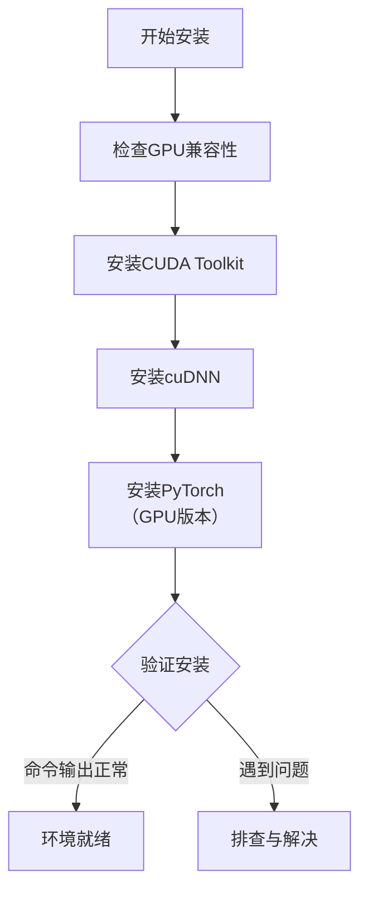

[微信公众号：数学建模与人工智能](https://mp.weixin.qq.com/s?__biz=MzI5MTY1MzU1Mg==&mid=100000890&idx=1&sn=c1a6abaeeeba9cad51dd100aaa21e5bc&scene=19#wechat_redirect)
[https://github.com/QInzhengk/Math-Model-and-Machine-Learning](https://github.com/QInzhengk/Math-Model-and-Machine-Learning)
@[TOC](Keras和Tensorflow（CPU）安装、Pytorch（CPU和GPU）安装)
# Keras和Tensorflow（CPU）安装
## 一、安装我用的是清华大学源
**keras安装：**

```bash
pip install -i https://pypi.tuna.tsinghua.edu.cn/simple keras
```

**tensorflow安装：**

```bash
pip install -i https://pypi.tuna.tsinghua.edu.cn/simple tensorflow
```
**注**：**我用的是cmd管理员安装，在安装tensorflow的时候有错误或者很长时间没有往下进行可以按下**enter**键，这样安装是可以在windows环境下Anaconda和Pycharm都可以使用。**

初学者，上述安装的是CPU版，tensorflow GPU比CPU版本运行速度要快，但是安装比较麻烦，网上还有很多Anaconda环境下得安装教程，是在Anaconda环境下搭建的GPU版，有些对你电脑配置会有要求。


## 二、深度学习模型保存与加载
**方法一**（我的程序会报错）

```bash
import joblib

#train the model

model.fit(X,y,epochs=200)

joblib.dump(model1, './model1.pkl')

tokenizer = joblib.load('./model1.pkl')
```

**方法二**

```bash
from keras.models import load_model

# 模型保存

model.save('./model1.h5')

# 模型加载

model2 = load_model('./model1.h5')

# 模型重新训练，重新 fit

y2_predict = model2.predict(X2) 
```

## 三、错误
**1、在学习过程中遇到**
```python
from keras.utils import to_categorical
```
**这样写出现错误：**
**ImportError: cannot import name 'to_categorical' from 'keras.utils' (D:\Anaconda3\lib\site-packages\keras\utils\__init__.py)**
改成：
```python
from tensorflow.keras.utils import to_categorical
```

**2、错误**
Failed to find data adapter that can handle input: <class ‘numpy.ndarray’>, (<class ‘list’> containing values of types {"<class ‘numpy.float64’>"})

```bash
#train the model
model.fit(X,y,batch_size=30,epochs=200)
```


查看发现变量类型不对，改成：

```bash
print(type(X),type(y))
y=np.array(y)
print(type(X),type(y))
```

## TensorBoard 是一个非常好用的可视化工具

**1.数据写入**

在keras中使用方法如下：

```python
import keras
TensorBoardcallback=keras.callbacks.TensorBoard(log_dir='./logs', 
histogram_freq=0, write_graph=True, write_images=False, 
embeddings_freq=0, embeddings_layer_names=None, embeddings_metadata=None)
model.fit(callbacks = [TensorBoardcallback])
```

在TensorFlow中使用方法如下：

```python
import tensorflow as tf 
TensorBoardcallback=tf.keras.callbacks.TensorBoard(log_dir='./logs', 
histogram_freq=0, write_graph=True, write_images=False, 
embeddings_freq=0, embeddings_layer_names=None, embeddings_metadata=None)
model.fit(callbacks = [TensorBoardcallback])
```

**参数介绍：**

> log_dir: 用来保存被 TensorBoard 分析的日志文件的文件名。 
> histogram_freq:对于模型中各个层计算激活值和模型权重直方图的频率（训练轮数中）。 如果设置成 0，直方图不会被计算。对于直方图可视化的验证数据（或分离数据）一定要明确的指出。 
> write_graph: 是否在 TensorBoard中可视化图像。 如果 write_graph 被设置为 True，日志文件会变得非常大。 write_grads: 是否在TensorBoard 中可视化梯度值直方图。 histogram_freq 必须要大于 0 。 
> batch_size:用以直方图计算的传入神经元网络输入批的大小。 
> write_images: 是否在 TensorBoard 中将模型权重以图片可视化。
> embeddings_freq: 被选中的嵌入层会被保存的频率（在训练轮中）。 
> embeddings_layer_names:一个列表，会被监测层的名字。 如果是 None 或空列表，那么所有的嵌入层都会被监测。 
> embeddings_metadata:一个字典，对应层的名字到保存有这个嵌入层元数据文件的名字。 查看 详情 关于元数据的数据格式。以防同样的元数据被用于所用的嵌入层，字符串可以被传入。 
> embeddings_data: 要嵌入在embeddings_layer_names 指定的层的数据。 Numpy 数组（如果模型有单个输入）或 Numpy数组列表（如果模型有多个输入）。 Learn ore about embeddings。 
> update_freq: ‘batch’ 或‘epoch’ 或 整数。当使用 ‘batch’ 时，在每个 batch 之后将损失和评估值写入到 TensorBoard中。同样的情况应用到 ‘epoch’ 中。如果使用整数，例如 10000，这个回调会在每 10000 个样本之后将损失和评估值写入到TensorBoard 中。注意，频繁地写入到 TensorBoard 会减缓你的训练。

**2.数据可视化**

运行如下命令：

```python
tensorboard --logdir=/full_path_to_your_logs
```

在浏览器中打开： [http://127.0.0.1:6006/](http://127.0.0.1:6006/)

然后可以看到训练的过程和模型的数据

**TensorFlow回调函数：`tf.keras.callbacks.ModelCheckpoint`**
在每个训练期（epoch）后保存模型。

filepath可以包含命名格式化选项，可以由epoch的值和logs的键（由on_epoch_end参数传递）来填充。

例如：如果filepath是weights.{epoch:02d}-{val_loss:.2f}.hdf5，则模型检查点将与文件名中的epoch号和验证损失一起保存。

参数：

 - filepath：string，保存模型文件的路径。 
 - monitor：要监测的数量。 verbose：详细信息模式，0或1。
 - save_best_only：如果save_best_only=True，被监测数量的最佳型号不会被覆盖。
 - mode：{auto，min，max}之一。如果save_best_only=True，那么是否覆盖保存文件的决定就取决于被监测数据的最大或者最小值。对于val_acc，这应该是max，对于val_loss这应该是min，等等。在auto模式中，方向是从监测数量的名称自动推断出来的。
 - save_weights_only：如果为True，则仅保存模型的权重（model.save_weights(filepath)），否则保存完整模型（model.save(filepath)）。
 - period：检查点之间的间隔（epoch数）。

**EarlyStopping是什么**
EarlyStopping是Callbacks的一种，callbacks用于指定在每个epoch开始和结束的时候进行哪种特定操作。Callbacks中有一些设置好的接口，可以直接使用，如’acc’,’val_acc’,’loss’和’val_loss’等等。

EarlyStopping则是用于提前停止训练的callbacks。具体地，可以达到当训练集上的loss不在减小（即减小的程度小于某个阈值）的时候停止继续训练。

**为什么要用EarlyStopping**

根本原因就是因为继续训练会导致测试集上的准确率下降。

那继续训练导致测试准确率下降的原因猜测可能是1. 过拟合 2. 学习率过大导致不收敛 3. 使用正则项的时候，Loss的减少可能不是因为准确率增加导致的，而是因为权重大小的降低。

当然使用EarlyStopping也可以加快学习的速度，提高调参效率。

**EarlyStopping的使用与技巧**

一般是在model.fit函数中调用callbacks，fit函数中有一个参数为callbacks。注意这里需要输入的是list类型的数据，所以通常情况只用EarlyStopping的话也要是[EarlyStopping()]

**EarlyStopping的参数有**

> monitor:监控的数据接口，有’acc’,’val_acc’,’loss’,’val_loss’等等。正常情况下如果有验证集，就用’val_acc’或者’val_loss’。但是因为笔者用的是5折交叉验证，没有单设验证集，所以只能用’acc’了。
> min_delta：增大或减小的阈值，只有大于这个部分才算作improvement。这个值的大小取决于monitor，也反映了你的容忍程度。例如笔者的monitor是’acc’，同时其变化范围在70%-90%之间，所以对于小于0.01%的变化不关心。加上观察到训练过程中存在抖动的情况（即先下降后上升），所以适当增大容忍程度，最终设为0.003%。
> patience：能够容忍多少个epoch内都没有improvement。这个设置其实是在抖动和真正的准确率下降之间做tradeoff。如果patience设的大，那么最终得到的准确率要略低于模型可以达到的最高准确率。如果patience设的小，那么模型很可能在前期抖动，还在全图搜索的阶段就停止了，准确率一般很差。patience的大小和learning rate直接相关。在learning rate设定的情况下，前期先训练几次观察抖动的epoch number，比其稍大些设置patience。在learning rate变化的情况下，建议要略小于最大的抖动epoch number。笔者在引入EarlyStopping之前就已经得到可以接受的结果了，EarlyStopping算是锦上添花，所以patience设的比较高，设为抖动epoch number的最大值。 
> mode: 就’auto’, ‘min’,‘,max’三个可能。如果知道是要上升还是下降，建议设置一下。笔者的monitor是’acc’，所以mode=’max’。min_delta和patience都和“避免模型停止在抖动过程中”有关系，所以调节的时候需要互相协调。通常情况下，min_delta降低，那么patience可以适当减少；min_delta增加，那么patience需要适当延长；反之亦然。

# Pytorch Anaconda虚拟环境安装
## 一、安装步骤

 - 打开Anaconda Prompt
 - 创建环境pytorch，使用Python版本是3.7（之后，在加载过程中会弹出提示，输入 y，即可安装。）

```bash
conda create -n pytorch python=3.7
```

 - 查看环境是否安装成功（可以看到包含base和pytorch两个环境（*表示当前所在环境））
```bash
conda info --envs
```


 - 进入创建的pytorch环境
```bash
conda activate pytorch
```

 - 安装pytorch

根据自己的安装版本，在[Pytorch官网](https://pytorch.org/)（[https://pytorch.org/](https://pytorch.org/)）寻找安装命令代码：


将复制的代码粘贴到命令行格式下，弹出提示，输入 y，即可完成安装（根据自己想要按照的CPU或者GPU版本选择）。

 - 测试pytorch


## 二、jupyter使用虚拟环境
(注：这里我创建了两个虚拟环境tensorflow和pytorch，有一个不起作用，不知道为啥)
```bash
# 包的管理
conda install -n 某个环境 包名(=版本号)
conda uninstall -n 某个环境 包名
```

 - 添加虚拟环境到jupyter中

```bash
conda install jupyter
conda install ipykernel		# 安装jupyter内核
python -m ipykernel install --user --name 虚拟环境名 --display-name 在jupyter中显示的环境名称
```

 - 移除jupyter中的虚拟环境

```bash
jupyter kernelspec remove 环境名
```


# Windows11安装GPU深度学习环境教程（CUDA，cuDNN，Pytorch）
在Windows 11上配置支持GPU的PyTorch深度学习环境，关键在于按顺序安装CUDA工具包和兼容的cuDNN库，最后安装与之匹配的PyTorch版本。

可以按图索骥：



### 🛠️ 安装前的准备工作

在开始之前，核心的准备工作是确认你的显卡是否支持CUDA。

1.  **检查GPU兼容性**：
    - 同时按下 `Ctrl + Shift + Esc` 打开任务管理器，在“性能”选项卡下找到你的GPU型号。或者，按下 `Win + R` 键，输入 `cmd` 打开命令提示符，然后输入 `nvidia-smi` 命令。
    - 如果命令成功执行，窗口右上角会显示当前驱动支持的 **最高CUDA版本**（例如12.8）。请记下这个版本号，作为选择CUDA Toolkit版本的参考。
    - 如果命令无法识别，说明你可能需要先安装或更新NVIDIA显卡驱动。你可以访问[NVIDIA驱动下载页面](https://www.nvidia.com/Download/index.aspx)根据你的显卡型号下载并安装最新的驱动。

2.  **一些可选工具**：
    - **Anaconda/Miniconda**：强烈推荐使用Conda来管理Python环境和软件包，它可以避免依赖冲突。
    - **Visual Studio**：如果你计划进行C++层面的CUDA开发，需要安装Visual Studio。如果仅使用PyTorch，则不必安装。

### 📥 安装CUDA Toolkit

1.  **下载CUDA**：访问 [NVIDIA CUDA Toolkit Archive](https://developer.nvidia.com/cuda-toolkit-archive) 页面。在选择版本时，建议选取不高于 `nvidia-smi` 命令显示版本的CUDA Toolkit。例如，驱动支持12.8，你可以选择安装12.8或更低的12.x版本。
2.  **安装CUDA**：运行下载的安装程序（建议安装在非C盘）。
    - 在安装选项界面，建议选择 **“自定义”** 安装。
    - 在组件列表中，**务必取消勾选 “Driver components” 下的 “Display Driver”**，以避免覆盖你现有的显卡驱动。
    - 如果不需要在Visual Studio中进行CUDA开发，也可以取消勾选“Visual Studio Integration”。
3.  **验证安装**：
    - 安装完成后，重启电脑以确保环境变量生效。
    - 重新打开命令提示符，输入 `nvcc -V`。如果显示CUDA编译器的版本信息，说明CUDA安装成功。
    - 你也可以进入CUDA安装目录下的 `extras\demo_suite` 文件夹，运行 `deviceQuery.exe` 和 `bandwidthTest.exe`，如果两者都输出 `Result = PASS`，则表明GPU设备可正常访问。

### 📂 安装cuDNN库

cuDNN是NVIDIA针对深度学习的加速库。

1.  **下载cuDNN**：访问 [NVIDIA cuDNN下载页面](https://developer.nvidia.com/cudnn)（需要注册并登录NVIDIA账号）。根据你安装的CUDA版本，选择**兼容的cuDNN版本**进行下载。
2.  **安装cuDNN**：cuDNN的安装本质上是文件的复制。
    - 将下载的cuDNN压缩包解压，你会看到 `bin`、`include`、`lib` 等文件夹。
    - 将这些文件夹内的**全部内容**，复制到你的CUDA安装目录（例如 `C:\Program Files\NVIDIA GPU Computing Toolkit\CUDA\v12.6`）下的对应文件夹中。如果系统询问是否覆盖或合并文件夹，选择“是”即可。

### 🔮 安装PyTorch（GPU版本）

这是最后一步，确保PyTorch能调用你安装好的CUDA。

1. **创建并激活Conda环境（推荐）**：这可以隔离项目依赖。

   ```bash
   conda create --name pytorch_gpu python=3.11
   conda activate pytorch_gpu
   ```

2. **安装PyTorch**：访问 [PyTorch官方网站](https://pytorch.org/get-started/locally/)，使用网站提供的配置器生成安装命令。

   - 根据你的CUDA版本，选择对应的PyTorch版本。请务必确保这里选择的CUDA版本与你之前安装的**完全一致**。
   - 复制生成的命令并运行。例如，针对CUDA 12.6，你可能需要运行类似以下的命令：

   ```bash
   pip3 install torch torchvision torchaudio --index-url https://download.pytorch.org/whl/cu126
   ```

### ✅ 验证整个环境

所有安装完成后，必须验证PyTorch是否能正确识别GPU。

1. 打开命令提示符，并激活你的Conda环境（如果你使用了的话）。

2. 运行Python，然后依次输入以下命令：

   ```python
   import torch
   print(torch.__version__)  # 查看PyTorch版本
   print(torch.cuda.is_available())  # 输出应为 True
   print(torch.cuda.current_device())  # 输出当前GPU设备索引 (例如 0)
   print(torch.cuda.get_device_name(0))  # 输出你的GPU型号名称
   ```

   如果 `torch.cuda.is_available()` 返回 `True`，并且能正确打印出你的GPU型号，那么恭喜你，Windows下的PyTorch-GPU环境已经配置成功！

### 💡 可能遇到的问题与解决思路

- **版本匹配是关键**：这是最常见的问题。请务必确保**显卡驱动 → CUDA Toolkit → cuDNN → PyTorch** 这一链条上的所有组件版本都是相互兼容的。
- **环境变量问题**：如果 `nvcc -V` 命令不识别，请检查系统环境变量 `Path` 中是否已添加了CUDA的 `bin` 和 `libnvvp` 目录的路径。
- **安装程序冲突**：如果在安装CUDA时遇到问题，可以尝试使用专门的DDU（Display Driver Uninstaller）工具在安全模式下彻底卸载原有NVIDIA驱动，再重新安装。


