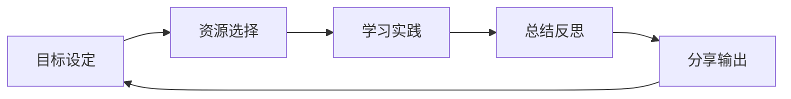

# 🔗 技术资源生态系统

精选优质技术平台与学习资源，构建从入门到精通的完整学习生态链。

## 🌟 核心技术平台

### 📚 CSDN技术社区
- [CSDN博客推荐](./csdn.md)
  - **技术博客**：数学建模、AI算法、工程实践
  - **专栏推荐**：系统化学习路径规划
  - **专家资源**：行业大牛经验分享

### 🤖 知乎技术社区
- [知乎精选](./zhihu.md)
  - **技术问答**：深度讨论与解决方案
  - **专栏文章**：系统性技术解析
  - **行业洞察**：技术趋势与职业发展

### 📱 微信生态
- [微信公众号](./wechat.md)
  - **技术推送**：最新技术动态
  - **学习资源**：精选文章整理
  - **互动社区**：技术交流平台

### 🐙 GitHub技术

  - **个人品牌**：技术影响力建设
  - **开源项目**：项目展示与管理
  - **协作开发**：团队协作最佳实践

## 🎯 学习资源地图

### 📺 视频学习平台
| 平台 | 特色内容 | 适合人群 |
|------|----------|----------|
| **B站技术区** | 中文技术视频，实战教程 | 初中级学习者 |
| **慕课平台** | 系统化课程，认证证书 | 系统学习需求 |
| **YouTube** | 英文前沿技术，国际视野 | 进阶开发者 |
| **技术大会** | 行业趋势，专家分享 | 所有技术人群 |

### 🛠️ 实战练习平台
| 平台 | 练习类型 | 难度等级 |
|------|----------|----------|
| **LeetCode** | 算法面试题 | 面试准备 |
| **Kaggle** | 数据科学竞赛 | 数据科学家 |
| **牛客网** | 编程竞赛求职 | 求职者 |
| **GitHub** | 开源项目实践 | 开发者 |

### 📰 技术资讯渠道
| 渠道 | 内容类型 | 更新频率 |
|------|----------|----------|
| **InfoQ** | 深度技术文章 | 每日 |
| **掘金** | 社区优质内容 | 实时 |
| **SegmentFault** | 技术问答 | 持续 |
| **开源中国** | 开源资讯 | 每日 |

## 💡 高效学习策略

### 🎯 分阶段学习路径

#### 🌱 入门阶段
- **目标**：建立基础认知
- **方法**：系统视频教程 + 基础练习
- **资源**：B站 + 慕课平台
- **周期**：2-3个月

#### 🚀 进阶阶段
- **目标**：深度理解与应用
- **方法**：实战项目 + 技术博客
- **资源**：GitHub + 技术社区
- **周期**：4-6个月

#### 🏆 专家阶段
- **目标**：技术创新与影响力
- **方法**：开源贡献 + 技术分享
- **资源**：技术大会 + 行业交流
- **周期**：持续学习

### 🔄 学习循环优化

### 📈 学习效率提升

#### ⏰ 时间管理
- **番茄工作法**：25分钟专注 + 5分钟休息
- **任务分解**：大目标拆分为小任务
- **优先级排序**：重要紧急四象限

#### 🧠 记忆优化
- **费曼学习法**：用自己的话解释概念
- **间隔重复**：艾宾浩斯遗忘曲线
- **联想记忆**：建立知识网络连接

#### 💼 实践应用
- **项目驱动**：通过项目学习技术
- **知识输出**：写博客、做分享
- **教学相长**：教是最好的学习方式

## 🌐 社区参与指南

### 💬 技术交流技巧
- **提问方式**：明确问题背景、已尝试方案
- **回答质量**：逻辑清晰、代码规范、结果验证
- **讨论礼仪**：尊重他人观点、建设性反馈

### 🎓 个人品牌建设
- **技术博客**：定期输出高质量内容
- **开源贡献**：参与感兴趣的项目
- **技术分享**：参加meetup、技术沙龙

### 🤝 网络拓展策略
- **线上社区**：活跃参与讨论
- **线下活动**：技术会议、workshop
- **导师指导**：寻找行业导师

## 🚀 职业发展资源

### 📈 技能提升路径
- **技术深度**：专精某一技术领域
- **技术广度**：了解相关技术栈
- **软技能**：沟通、管理、领导力

### 💼 求职准备指南
- **简历优化**：项目经验量化表达
- **面试准备**：算法 + 系统 + 项目
- **offer选择**：公司文化 + 技术栈 + 发展空间

---

**构建个人技术生态系统，持续学习，终身成长！** 🌟

---

*优质资源如明灯，指引我们走向技术的殿堂！*